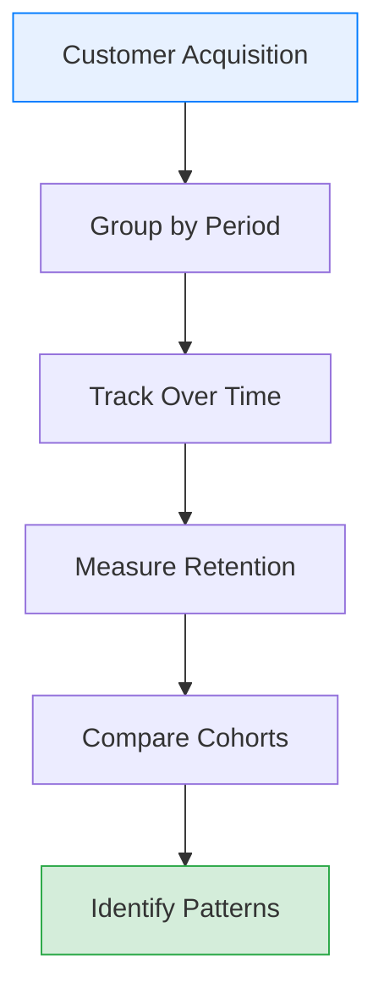
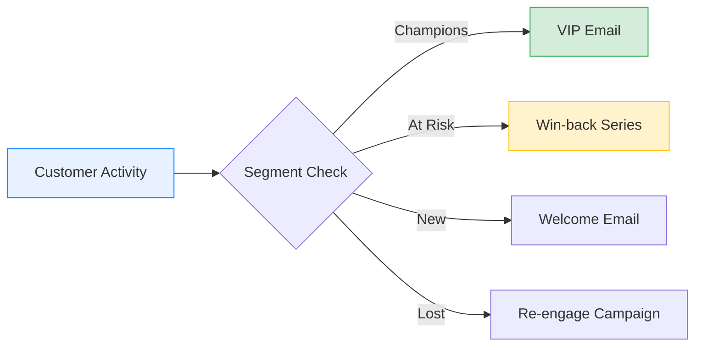

# Customer Segmentation

## Overview

Customer Segmentation enables you to divide your customer base into distinct groups based on behavior, value, and characteristics. This documentation covers RFM analysis, cohort tracking, segmentation criteria, and visualization tools.

---

## RFM Analysis

### Understanding RFM

RFM (Recency, Frequency, Monetary) analysis is a proven technique for customer segmentation:

| Dimension | Definition | Measurement |
|-----------|------------|-------------|
| **R**ecency | How recently did the customer purchase? | Days since last order |
| **F**requency | How often do they purchase? | Total number of orders |
| **M**onetary | How much do they spend? | Total revenue from customer |

### RFM Scoring System

Each dimension is scored from 1-5 (5 being best):

**Recency Scoring:**

| Days Since Purchase | Score |
|--------------------|-------|
| 0-30 days | 5 |
| 31-60 days | 4 |
| 61-90 days | 3 |
| 91-180 days | 2 |
| 180+ days | 1 |

**Frequency Scoring:**

| Order Count | Score |
|------------|-------|
| 10+ orders | 5 |
| 7-9 orders | 4 |
| 4-6 orders | 3 |
| 2-3 orders | 2 |
| 1 order | 1 |

**Monetary Scoring:**

| Total Spend | Score |
|------------|-------|
| $5,000+ | 5 |
| $2,500-$4,999 | 4 |
| $1,000-$2,499 | 3 |
| $500-$999 | 2 |
| $0-$499 | 1 |

### RFM Segment Definitions

Combined RFM scores create customer segments:

| Segment | RFM Scores | Description | Count | % |
|---------|------------|-------------|-------|---|
| Champions | 555, 554, 545 | Best customers, buy frequently | 45 | 15% |
| Loyal Customers | 543, 444, 435 | Regular buyers with good value | 68 | 22.7% |
| Potential Loyalists | 532, 413, 423 | Recent customers with potential | 37 | 12.3% |
| New Customers | 512, 411, 311 | Just started purchasing | 42 | 14% |
| Promising | 312, 322, 331 | Recent shoppers, low frequency | 28 | 9.3% |
| Need Attention | 233, 224, 143 | Above average but declining | 35 | 11.7% |
| At Risk | 244, 234, 144 | Spent big but haven't returned | 22 | 7.3% |
| Can't Lose | 155, 145, 154 | High value but haven't purchased | 8 | 2.7% |
| Lost | 111, 112, 121 | Lowest scores across all metrics | 15 | 5% |

---

## Customer Segments Visualization

### Segment Distribution

```
Customer Segment Distribution (Total: 300 customers)
----------------------------------------------------

High Value (>$5,000/year)
████████████████  45 customers (15%)

Regular ($1,000-$5,000/year)
████████████████████████████████████████████████████  105 customers (35%)

Occasional (<$1,000/year)
██████████████████████████████████████████████████████████████████████████  150 customers (50%)
```

### Segment Characteristics

**High Value Customers:**

| Metric | Value |
|--------|-------|
| Customer Count | 45 |
| Percentage | 15% |
| Avg Annual Spend | $8,450 |
| Avg Order Value | $425 |
| Order Frequency | 19.9 orders/year |
| Total Revenue | $380,250 (38.9%) |

**Regular Customers:**

| Metric | Value |
|--------|-------|
| Customer Count | 105 |
| Percentage | 35% |
| Avg Annual Spend | $2,850 |
| Avg Order Value | $285 |
| Order Frequency | 10 orders/year |
| Total Revenue | $299,250 (30.6%) |

**Occasional Customers:**

| Metric | Value |
|--------|-------|
| Customer Count | 150 |
| Percentage | 50% |
| Avg Annual Spend | $650 |
| Avg Order Value | $216 |
| Order Frequency | 3 orders/year |
| Total Revenue | $97,500 (30.5%) |

---

## Cohort Analysis

### What is Cohort Analysis?

Cohort analysis groups customers by their acquisition period and tracks behavior over time:



### Retention by Cohort

**Monthly Cohort Retention Rates:**

| Cohort | Month 0 | Month 1 | Month 2 | Month 3 | Month 6 | Month 12 |
|--------|---------|---------|---------|---------|---------|----------|
| Jan 2025 | 100% | 42% | 35% | 30% | 25% | 20% |
| Feb 2025 | 100% | 45% | 38% | 32% | 27% | 21% |
| Mar 2025 | 100% | 43% | 36% | 31% | 26% | 19% |
| Apr 2025 | 100% | 48% | 40% | 34% | 28% | - |
| May 2025 | 100% | 46% | 39% | 33% | - | - |
| Jun 2025 | 100% | 44% | 37% | - | - | - |

### Revenue by Cohort

| Cohort | Customers | LTV (12mo) | Avg Revenue | Best Segment |
|--------|-----------|------------|-------------|--------------|
| Q1 2025 | 125 | $285,000 | $2,280 | Electronics |
| Q2 2025 | 142 | $312,000 | $2,197 | Clothing |
| Q3 2025 | 158 | $298,000 | $1,886 | Home & Garden |
| Q4 2025 | 175 | $275,000 | $1,571 | Sports |

---

## Segmentation Criteria

### Available Segmentation Dimensions

| Dimension | Description | Options |
|-----------|-------------|---------|
| Purchase Behavior | Based on buying patterns | Frequency, recency, value |
| Demographics | Customer attributes | Region, account age |
| Product Affinity | Category preferences | Electronics, Clothing, etc. |
| Engagement | Interaction levels | Active, Dormant, Churned |
| Value Tier | Revenue contribution | High, Medium, Low |

### Creating Custom Segments

1. Navigate to **Customers** > **Segments**
2. Click **Create Segment**
3. Define segment criteria:

```
Segment: High-Value Electronics Buyers
--------------------------------------
Criteria:
  - Total Spend > $2,000 AND
  - Primary Category = "Electronics" AND
  - Last Purchase < 90 days AND
  - Order Count >= 3
```

4. Preview matching customers
5. Save segment

### Segment Rules

**Available Operators:**

| Operator | Description | Example |
|----------|-------------|---------|
| Equals | Exact match | Region = "Region A" |
| Greater than | Above value | Spend > $1,000 |
| Less than | Below value | Days since purchase < 30 |
| Between | Range of values | Orders between 5 and 10 |
| Contains | Partial match | Email contains "@company" |
| Is empty | No value | Phone is empty |

---

## Segment Actions

### Marketing Applications

| Segment | Recommended Action | Channel |
|---------|-------------------|---------|
| Champions | VIP rewards, early access | Email, Direct |
| Loyal Customers | Loyalty program, referral bonus | Email |
| Potential Loyalists | Cross-sell, frequency incentives | Email, Push |
| New Customers | Welcome series, product education | Email |
| At Risk | Win-back campaign, special offer | Email, Retargeting |
| Lost | Re-engagement, survey | Email |

### Automated Triggers

Configure automated actions based on segment membership:



---

## Export Segment Lists

### Export Options

| Format | Contents | Use Case |
|--------|----------|----------|
| CSV | Customer IDs, emails, details | Email marketing platforms |
| Excel | Full customer data | Analysis, reporting |
| API | Real-time segment data | Integration with other systems |

### Export Steps

1. Go to **Customers** > **Segments**
2. Select the segment to export
3. Click **Export** dropdown
4. Choose format (CSV, Excel)
5. Select fields to include:
   - [ ] Customer ID
   - [ ] Email
   - [ ] Name
   - [ ] Phone
   - [ ] Segment Score
   - [ ] Last Purchase Date
   - [ ] Total Spend
6. Click **Download**

### Scheduled Exports

Set up automatic segment exports:

| Setting | Options |
|---------|---------|
| Frequency | Daily, Weekly, Monthly |
| Format | CSV, Excel |
| Delivery | Email, SFTP, Webhook |
| Recipients | Multiple email addresses |

---

## Segment Performance Tracking

### Key Metrics by Segment

| Segment | Customers | Revenue | AOV | Orders | Retention |
|---------|-----------|---------|-----|--------|-----------|
| Champions | 45 | $380,250 | $425 | 895 | 85% |
| Loyal | 68 | $193,800 | $305 | 635 | 72% |
| Potential | 37 | $48,100 | $260 | 185 | 55% |
| New | 42 | $35,700 | $212 | 168 | 45% |
| At Risk | 22 | $28,600 | $275 | 104 | 25% |
| Lost | 15 | $8,250 | $165 | 50 | 5% |

### Segment Migration

Track how customers move between segments:

| From Segment | To Champions | To Loyal | To At Risk | To Lost |
|--------------|--------------|----------|------------|---------|
| New | 8% | 25% | 12% | 15% |
| Potential | 15% | 35% | 10% | 8% |
| At Risk | 5% | 12% | - | 45% |

---

## Visualization Examples

### Customer Value Distribution

```
Customer Lifetime Value Distribution
------------------------------------

$10,000+  ██████  8 customers
$5,000-$9,999  ████████████████████  37 customers
$2,500-$4,999  ████████████████████████████████  68 customers
$1,000-$2,499  ████████████████████████████████████████  85 customers
$500-$999  ████████████████████████████████████████████████  102 customers
$0-$499  (excluded from active analysis)
```

### Segment Trend Over Time

| Month | Champions | Loyal | At Risk | Lost |
|-------|-----------|-------|---------|------|
| Sep 2025 | 42 | 62 | 28 | 18 |
| Oct 2025 | 43 | 65 | 25 | 17 |
| Nov 2025 | 44 | 67 | 24 | 16 |
| Dec 2025 | 45 | 68 | 22 | 15 |

---

## Best Practices

### Effective Segmentation

1. **Start Simple** - Begin with basic RFM before complex criteria
2. **Regular Updates** - Refresh segments monthly minimum
3. **Test Assumptions** - Validate segment definitions with data
4. **Act on Insights** - Use segments for targeted actions
5. **Monitor Migration** - Track movement between segments

### Common Mistakes

| Mistake | Impact | Solution |
|---------|--------|----------|
| Too many segments | Diluted focus | Limit to 5-7 actionable segments |
| Static segments | Outdated targeting | Automate regular refreshes |
| Ignoring small segments | Missed opportunities | Review all segment sizes |
| No action plans | Wasted analysis | Define actions for each segment |

---

## Related Documentation

- [Dashboard Overview](./dashboard-overview.md) - View segment metrics
- [Sales Analytics](./sales-analytics.md) - Revenue by segment
- [Report Generation](./report-generation.md) - Segment reports

---

**Document Version:** 1.0
**Last Updated:** January 2026
**Status:** Active
