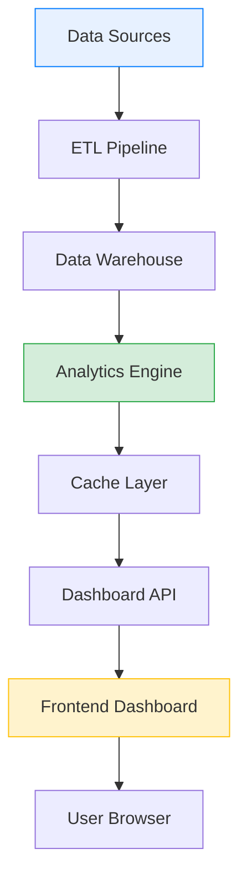

# Dashboard Overview

## Purpose

The Dashboard serves as the central command center for monitoring your business performance. It provides real-time visibility into key metrics, trends, and actionable insights that help drive informed decision-making.

This documentation covers the main features, navigation, and customization options available in the Dashboard module.

---

## Key Metrics Displayed

The Dashboard displays four primary Key Performance Indicators (KPIs) at the top of the screen:

### Revenue

| Metric | Description | Update Frequency |
|--------|-------------|------------------|
| Total Revenue | Sum of all completed order amounts | Real-time |
| Period Comparison | Percentage change vs previous period | Hourly |
| Revenue Trend | Visual indicator (up/down arrow) | Real-time |

The revenue metric calculates the total monetary value of all completed transactions within the selected time period. The comparison percentage shows growth or decline relative to the equivalent previous period.

### Orders

| Metric | Description | Update Frequency |
|--------|-------------|------------------|
| Total Orders | Count of all orders placed | Real-time |
| Completion Rate | Percentage of orders fulfilled | Hourly |
| Order Trend | Period-over-period comparison | Real-time |

Order count includes all order statuses: pending, processing, completed, and cancelled. Use filters to view specific order types.

### Customers

| Metric | Description | Update Frequency |
|--------|-------------|------------------|
| Active Customers | Unique customers with activity | Daily |
| New Customers | First-time customers this period | Real-time |
| Retention Rate | Returning customer percentage | Weekly |

Active customers are defined as those who have placed at least one order or logged into their account within the selected time period.

### Growth Rate

| Metric | Description | Calculation |
|--------|-------------|-------------|
| Period Growth | Current vs previous period | ((Current - Previous) / Previous) x 100 |
| YoY Growth | Year-over-year comparison | ((This Year - Last Year) / Last Year) x 100 |
| Trend Indicator | Direction of growth | Positive (green) / Negative (red) |

---

## Navigation

### Main Menu Access

1. Click the **Dashboard** icon in the top navigation bar
2. The system loads your default dashboard configuration
3. Current period data displays automatically

### Time Period Selection

The date range selector is located in the top-right corner of the dashboard:

**Available Presets:**
- Today
- Last 7 Days
- Last 30 Days
- Last 90 Days
- Last 12 Months
- Custom Range

**Custom Date Range:**
1. Click the date selector dropdown
2. Select "Custom Range"
3. Choose start date from the calendar
4. Choose end date from the calendar
5. Click **Apply** to refresh the dashboard

> **Note:** Selecting large date ranges may increase loading time. For optimal performance, limit custom ranges to 365 days or less.

### Quick Filters

Apply quick filters to segment your dashboard data:

| Filter | Options | Description |
|--------|---------|-------------|
| Region | All, Region A, B, C, D | Geographic segmentation |
| Category | All, Electronics, Clothing, etc. | Product category filter |
| Segment | All, High Value, Regular, Occasional | Customer segment filter |
| Status | All, Active, Inactive | Customer activity status |

**To apply filters:**
1. Click the filter dropdown
2. Select your desired option
3. Dashboard updates automatically
4. Multiple filters can be combined

---

## Dashboard Components

### KPI Cards

The four KPI cards at the top provide at-a-glance metrics:

```
+------------------+  +------------------+  +------------------+  +------------------+
|  Total Revenue   |  |  Total Orders    |  | Active Customers |  |   Growth Rate    |
|    $978,450      |  |      3,842       |  |      1,567       |  |     +12.5%       |
|   +12.5% vs LP   |  |   +8.3% vs LP    |  |  +15.2% vs LP    |  |   YoY: +18.2%    |
+------------------+  +------------------+  +------------------+  +------------------+
```

Each card displays:
- Metric label (top)
- Current value (center, large)
- Comparison to previous period (bottom)

### Charts Section

The dashboard includes multiple visualization types:

**Revenue Trend Chart (Line)**
- Shows monthly revenue progression
- 12-month rolling view
- Hover for exact values
- Trend line indicates direction

**Top Products Chart (Bar)**
- Displays top 5 products by revenue
- Horizontal bar format
- Color-coded by performance
- Click for product details

**Category Distribution (Pie/Doughnut)**
- Revenue breakdown by category
- Percentage and absolute values
- Interactive legend
- Drill-down capability

**Customer Segments (Pie)**
- Distribution across segments
- High Value / Regular / Occasional
- Customer count per segment
- Percentage breakdown

---

## Data Flow Architecture

The following diagram illustrates how data flows through the dashboard system:



**Components:**

1. **Data Sources** - Raw data from transactions, CRM, and external systems
2. **ETL Pipeline** - Extract, Transform, Load processes
3. **Data Warehouse** - Centralized data storage
4. **Analytics Engine** - Calculations and aggregations
5. **Cache Layer** - Performance optimization
6. **Dashboard API** - Data delivery endpoints
7. **Frontend Dashboard** - User interface

---

## Customization Options

### Layout Customization

Rearrange dashboard widgets to match your workflow:

1. Click **Customize** button (gear icon)
2. Select **Edit Layout**
3. Drag widgets to new positions
4. Resize by dragging corners
5. Click **Save Layout**

### Metric Selection

Choose which metrics to display:

1. Click **Customize** > **Metrics**
2. Check/uncheck metrics to show/hide
3. Drag to reorder priority
4. Click **Save Changes**

**Available Metrics:**
- [ ] Total Revenue
- [ ] Net Revenue
- [ ] Order Count
- [ ] Average Order Value
- [ ] Customer Count
- [ ] New Customers
- [ ] Returning Customers
- [ ] Conversion Rate

### Chart Preferences

Configure chart display settings:

| Setting | Options | Default |
|---------|---------|---------|
| Chart Type | Line, Bar, Area | Line |
| Time Granularity | Day, Week, Month | Month |
| Show Legend | Yes, No | Yes |
| Animation | Enabled, Disabled | Enabled |

---

## Performance Optimization

### Best Practices

For optimal dashboard performance:

1. **Use preset date ranges** - Faster than custom ranges
2. **Limit date span** - 90 days or less for real-time data
3. **Apply filters** - Narrow data scope when possible
4. **Clear cache** - If dashboard appears slow
5. **Close unused tabs** - Reduce browser memory usage

### Loading Indicators

| Indicator | Meaning |
|-----------|---------|
| Spinning icon | Data loading in progress |
| Gray overlay | Widget refreshing |
| Error badge | Data load failed |
| Stale badge | Data may be outdated |

---

## Troubleshooting

### Common Issues

| Issue | Possible Cause | Solution |
|-------|----------------|----------|
| Dashboard not loading | Network timeout | Refresh page, check connection |
| Metrics showing zero | No data for period | Select different date range |
| Charts not rendering | Browser incompatibility | Use Chrome or Firefox |
| Slow performance | Large date range | Select smaller time period |
| Filters not working | Cache issue | Clear browser cache |

### Error Messages

**"No data available for selected period"**
- The selected date range has no transactions
- Try expanding the date range or removing filters

**"Dashboard load timeout"**
- Server response took too long
- Refresh the page or try again later

**"Session expired"**
- Your login session has timed out
- Log in again to continue

---

## Related Documentation

- [Data Import](./data-import.md) - How to import data into the system
- [Sales Analytics](./sales-analytics.md) - Detailed sales analysis features
- [Customer Segmentation](./customer-segmentation.md) - Understanding customer segments
- [Report Generation](./report-generation.md) - Creating and scheduling reports

---

**Document Version:** 1.0
**Last Updated:** January 2026
**Status:** Active
