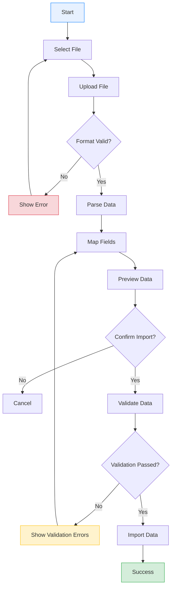

# Data Import Module

## Overview

The Data Import module enables you to upload external data files into the analytics platform. This documentation covers supported file formats, import workflows, validation rules, and troubleshooting common issues.

---

## Supported File Formats

The system accepts the following file formats:

| Format | Extension | Max Size | Notes |
|--------|-----------|----------|-------|
| CSV | `.csv` | 50 MB | UTF-8 encoding recommended |
| Excel | `.xlsx` | 25 MB | Excel 2007+ format |
| Excel (Legacy) | `.xls` | 10 MB | Excel 97-2003 format |

### Format Requirements

**CSV Files:**
- UTF-8 encoding (recommended)
- Comma-separated values
- First row must contain headers
- Consistent column count per row
- Text fields with commas must be quoted

**Excel Files:**
- Single sheet imports only
- First row must contain headers
- No merged cells in data area
- Formulas will be converted to values
- Remove charts/images before import

---

## Import Workflow

### Step-by-Step Process



### Detailed Steps

#### 1. Access Import Module

Navigate to **Data Management** > **Import Data** from the main menu.

#### 2. Select File Type

Choose the type of data you want to import:

- **Orders** - Sales transaction data
- **Customers** - Customer information
- **Products** - Product catalog data
- **Inventory** - Stock level updates

#### 3. Upload File

1. Click **Choose File** or drag and drop
2. Select your data file
3. Wait for upload to complete
4. System validates file format

#### 4. Map Fields

Match your file columns to system fields:

```
Your File Column          System Field
-----------------         ------------
Order_ID            -->   Order ID
Customer_Name       -->   Customer Name
Purchase_Date       -->   Order Date
Total_Amount        -->   Revenue
Product_SKU         -->   Product ID
```

**Mapping Options:**
- Auto-map (system suggests matches)
- Manual selection
- Skip column (don't import)
- Create new field

#### 5. Preview Data

Review the first 10 rows before importing:

| Row | Order ID | Customer | Date | Amount |
|-----|----------|----------|------|--------|
| 1 | ORD-001 | Customer A | 2026-01-01 | $150.00 |
| 2 | ORD-002 | Customer B | 2026-01-02 | $275.50 |
| 3 | ORD-003 | Customer C | 2026-01-03 | $89.99 |

**Preview Actions:**
- Scroll through rows
- Check data alignment
- Verify date formats
- Confirm numeric values

#### 6. Confirm and Import

Click **Start Import** to begin processing:

- Progress bar shows completion percentage
- Estimated time remaining displayed
- Option to cancel during import
- Results summary on completion

---

## Data Validation Rules

### Automatic Validations

The system applies these validations automatically:

| Field Type | Validation Rules |
|------------|------------------|
| Order ID | Unique, alphanumeric, max 50 chars |
| Date | Valid date format (YYYY-MM-DD recommended) |
| Amount | Numeric, positive values only |
| Email | Valid email format |
| Phone | Numeric with optional formatting |
| Required Fields | Cannot be empty |

### Validation Error Types

**Critical Errors (Block Import):**
- Duplicate primary keys
- Invalid required field values
- Data type mismatches
- Exceeded field length limits

**Warnings (Allow Import):**
- Missing optional fields
- Unusual values (outliers)
- Format inconsistencies
- Leading/trailing whitespace

### Error Report

After validation, download the error report:

```
Line    Field           Error                   Value
----    -----           -----                   -----
15      Order ID        Duplicate value         ORD-001
23      Amount          Invalid number          $abc
45      Order Date      Invalid date format     13/45/2026
78      Customer ID     Required field empty    (blank)
```

---

## Field Mapping Reference

### Order Data Fields

| System Field | Required | Format | Description |
|--------------|----------|--------|-------------|
| Order ID | Yes | Text | Unique order identifier |
| Order Date | Yes | Date | Transaction date |
| Customer ID | Yes | Text | Customer reference |
| Product ID | Yes | Text | Product reference |
| Quantity | Yes | Integer | Items purchased |
| Unit Price | Yes | Decimal | Price per item |
| Total Amount | Yes | Decimal | Line total |
| Status | No | Text | Order status |
| Region | No | Text | Geographic region |

### Customer Data Fields

| System Field | Required | Format | Description |
|--------------|----------|--------|-------------|
| Customer ID | Yes | Text | Unique customer identifier |
| Customer Name | Yes | Text | Full name or company |
| Email | No | Email | Contact email |
| Phone | No | Text | Contact phone |
| Address | No | Text | Mailing address |
| Segment | No | Text | Customer segment |
| Created Date | No | Date | Account creation date |

### Product Data Fields

| System Field | Required | Format | Description |
|--------------|----------|--------|-------------|
| Product ID | Yes | Text | Unique product identifier |
| Product Name | Yes | Text | Product title |
| Category | Yes | Text | Product category |
| Unit Price | Yes | Decimal | Standard price |
| Cost | No | Decimal | Product cost |
| Stock | No | Integer | Current inventory |
| Status | No | Text | Active/Inactive |

---

## Sample Data Format

### CSV Example

```csv
order_id,customer_id,order_date,product_id,quantity,unit_price,total_amount,region
ORD-10001,CUST-001,2026-01-15,PROD-A,2,150.00,300.00,Region A
ORD-10002,CUST-002,2026-01-15,PROD-B,1,275.00,275.00,Region B
ORD-10003,CUST-003,2026-01-16,PROD-C,3,89.99,269.97,Region A
ORD-10004,CUST-001,2026-01-16,PROD-A,1,150.00,150.00,Region A
ORD-10005,CUST-004,2026-01-17,PROD-D,2,199.50,399.00,Region C
```

### Excel Template

Download the Excel template for each data type:

- [Orders Template](#) - order_import_template.xlsx
- [Customers Template](#) - customer_import_template.xlsx
- [Products Template](#) - product_import_template.xlsx

> **Tip:** Using templates ensures correct column headers and formatting.

---

## Error Handling

### Common Import Errors

#### Duplicate Records

**Error:** `Duplicate primary key: ORD-10001`

**Cause:** An order with this ID already exists in the system.

**Solutions:**
1. Remove duplicate from import file
2. Use "Update existing" option
3. Generate new unique IDs

#### Invalid Date Format

**Error:** `Invalid date format on line 23`

**Cause:** Date doesn't match expected format.

**Solutions:**
1. Use YYYY-MM-DD format (recommended)
2. Configure alternative date format in settings
3. Fix source data before import

#### Data Type Mismatch

**Error:** `Expected number, found text on line 45`

**Cause:** Text value in numeric field.

**Solutions:**
1. Remove non-numeric characters
2. Check for currency symbols
3. Verify decimal separators

#### File Too Large

**Error:** `File exceeds maximum size limit`

**Cause:** Upload file larger than allowed.

**Solutions:**
1. Split file into smaller batches
2. Remove unnecessary columns
3. Compress data if possible

---

## Import Options

### Update Behavior

Choose how to handle existing records:

| Option | Behavior |
|--------|----------|
| Skip Duplicates | Ignore rows with existing IDs |
| Update Existing | Overwrite existing record data |
| Fail on Duplicate | Stop import if duplicate found |

### Data Transformations

Apply transformations during import:

- **Trim Whitespace** - Remove leading/trailing spaces
- **Uppercase** - Convert text to uppercase
- **Date Conversion** - Standardize date formats
- **Currency Conversion** - Apply exchange rates

---

## Import History

View past imports in **Data Management** > **Import History**:

| Date | File | Type | Records | Status | User |
|------|------|------|---------|--------|------|
| 2026-01-15 | orders_jan.csv | Orders | 1,234 | Success | user@example.com |
| 2026-01-14 | customers.xlsx | Customers | 567 | Partial | user@example.com |
| 2026-01-13 | products.csv | Products | 89 | Failed | user@example.com |

**Available Actions:**
- View import details
- Download error report
- Rollback import (if supported)
- Re-run import

---

## Best Practices

### Before Import

1. **Backup existing data** - Export current data before large imports
2. **Validate source data** - Check for errors in spreadsheet first
3. **Use templates** - Ensures correct formatting
4. **Test with sample** - Import small subset first
5. **Schedule appropriately** - Avoid peak usage times

### During Import

1. **Don't close browser** - Keep import page open
2. **Monitor progress** - Watch for errors
3. **Note the batch ID** - For reference if issues occur

### After Import

1. **Review summary** - Check record counts
2. **Spot check data** - Verify random records
3. **Run reports** - Confirm data appears correctly
4. **Document import** - Note any issues for future

---

## Related Documentation

- [Dashboard Overview](./dashboard-overview.md) - View imported data
- [Sales Analytics](./sales-analytics.md) - Analyze sales data
- [Report Generation](./report-generation.md) - Create reports from data

---

**Document Version:** 1.0
**Last Updated:** January 2026
**Status:** Active
