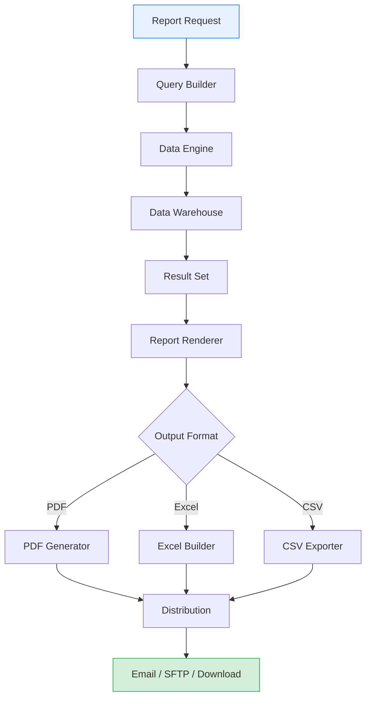
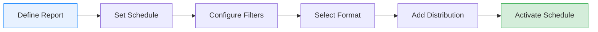

# Report Generation

## Overview

The Report Generation module provides tools for creating, scheduling, and distributing business reports. This documentation covers automated reports, custom report builders, export formats, and distribution options.

---

## System Architecture

### Report Generation Flow



### Technical Components

| Component | Technology | Purpose |
|-----------|------------|---------|
| Query Builder | SQL Generator | Create data queries |
| Data Engine | Analytics Service | Process calculations |
| Report Renderer | Template Engine | Format output |
| PDF Generator | PDF Library | Create PDF documents |
| Distribution | Email/SFTP | Deliver reports |

---

## Automated Scheduled Reports

### Available Scheduled Reports

| Report | Description | Default Schedule |
|--------|-------------|------------------|
| Daily Sales Summary | Orders, revenue, top products | Daily at 6:00 AM |
| Weekly Performance | Week-over-week comparison | Monday at 8:00 AM |
| Monthly Executive | Comprehensive monthly review | 1st of month, 9:00 AM |
| Inventory Alerts | Low stock notifications | Daily at 7:00 AM |
| Customer Activity | New, active, churned customers | Weekly, Tuesday |

### Creating a Scheduled Report

1. Navigate to **Reports** > **Scheduled Reports**
2. Click **New Schedule**
3. Configure report settings:

**Step 1: Select Report Type**

| Option | Description |
|--------|-------------|
| Sales Report | Revenue, orders, products |
| Customer Report | Segments, activity, retention |
| Product Report | Performance, inventory |
| Custom Report | Build from scratch |

**Step 2: Set Schedule**

| Frequency | Options |
|-----------|---------|
| Daily | Select time (00:00 - 23:00) |
| Weekly | Select day and time |
| Monthly | Select date (1-28) and time |
| Quarterly | First day of quarter |

**Step 3: Configure Filters**

```
Date Range: Last 7 days (rolling)
Region: All Regions
Category: Electronics, Clothing
Customer Segment: High Value, Regular
```

**Step 4: Set Distribution**

| Method | Configuration |
|--------|---------------|
| Email | Recipients, subject line |
| SFTP | Server, path, credentials |
| Webhook | URL, authentication |
| Storage | Cloud storage path |

### Managing Schedules

| Action | Description |
|--------|-------------|
| Pause | Temporarily stop schedule |
| Resume | Restart paused schedule |
| Edit | Modify schedule settings |
| Delete | Remove schedule permanently |
| Run Now | Execute immediately |
| View History | See past executions |

---

## Custom Report Builder

### Building Custom Reports

The drag-and-drop report builder enables creation of custom reports:

**Step 1: Select Data Source**

| Source | Data Available |
|--------|----------------|
| Orders | Transactions, line items |
| Customers | Profiles, segments |
| Products | Catalog, inventory |
| Combined | Joined data sets |

**Step 2: Choose Metrics**

Drag metrics to the report canvas:

- Revenue (Sum, Average, Min, Max)
- Order Count
- Customer Count
- Average Order Value
- Units Sold
- Profit Margin

**Step 3: Add Dimensions**

Group data by dimensions:

- Time (Day, Week, Month, Quarter, Year)
- Region (A, B, C, D)
- Category (Electronics, Clothing, etc.)
- Segment (High Value, Regular, Occasional)
- Product

**Step 4: Apply Filters**

| Filter Type | Example |
|-------------|---------|
| Date Range | Last 30 days |
| Value Range | Revenue > $1,000 |
| Category | Include: Electronics |
| Region | Exclude: Region D |

**Step 5: Format Output**

| Element | Options |
|---------|---------|
| Charts | Bar, Line, Pie, Table |
| Sorting | Ascending, Descending |
| Grouping | Subtotals, Grand totals |
| Formatting | Currency, Percentage, Number |

### Report Templates

Save custom reports as templates:

1. Build report in Report Builder
2. Click **Save as Template**
3. Name the template
4. Set visibility (Private, Team, Public)
5. Add description

**Available Templates:**

| Template | Created By | Last Modified |
|----------|------------|---------------|
| Monthly Executive Summary | System | Jan 2026 |
| Weekly Sales by Region | Admin | Jan 2026 |
| Product Performance | Admin | Jan 2026 |
| Customer Retention | System | Jan 2026 |

---

## Export Formats

### PDF Reports

**Characteristics:**

| Feature | Value |
|---------|-------|
| Format | PDF/A (archival) |
| Max Pages | 100 |
| Resolution | 300 DPI |
| Compression | Optimized |
| Security | Optional password |

**PDF Options:**

- [ ] Include cover page
- [ ] Add watermarks
- [ ] Include charts
- [ ] Show page numbers
- [ ] Add executive summary
- [ ] Include appendix

**Sample PDF Layout:**

```
+------------------------------------------+
|           MONTHLY SALES REPORT           |
|              January 2026                |
+------------------------------------------+
|                                          |
|  Executive Summary                       |
|  ----------------------------------------|
|  Total Revenue: $125,000                 |
|  Order Count: 418                        |
|  Growth: +12.5%                          |
|                                          |
|  [Revenue Trend Chart]                   |
|                                          |
|  [Top Products Table]                    |
|                                          |
|  [Regional Breakdown]                    |
|                                          |
+------------------------------------------+
|  Page 1 of 5  |  Generated: 2026-01-15  |
+------------------------------------------+
```

### Excel Reports

**Characteristics:**

| Feature | Value |
|---------|-------|
| Format | XLSX (Excel 2007+) |
| Max Rows | 100,000 |
| Sheets | Multiple (by section) |
| Formulas | Preserved |
| Charts | Embedded |

**Excel Structure:**

| Sheet | Contents |
|-------|----------|
| Summary | Key metrics, KPIs |
| Details | Transaction-level data |
| Charts | Visual representations |
| Pivot Data | Pre-formatted for pivots |

### CSV Reports

**Characteristics:**

| Feature | Value |
|---------|-------|
| Format | UTF-8 CSV |
| Max Rows | 500,000 |
| Delimiter | Comma (configurable) |
| Headers | First row |
| Encoding | UTF-8 with BOM |

**CSV Options:**

- Delimiter: Comma, Semicolon, Tab
- Quote character: Double quotes
- Escape character: Backslash
- Include headers: Yes/No
- Date format: YYYY-MM-DD

---

## Email Distribution

### Email Configuration

| Setting | Description |
|---------|-------------|
| Recipients | Email addresses (multiple) |
| CC | Carbon copy recipients |
| Subject | Email subject line |
| Body | Custom message text |
| Attachment | Report file format |

**Email Template Variables:**

| Variable | Description | Example |
|----------|-------------|---------|
| `{{report_name}}` | Report title | Monthly Sales |
| `{{date_range}}` | Report period | Jan 1-31, 2026 |
| `{{generated_date}}` | Generation timestamp | 2026-02-01 |
| `{{total_revenue}}` | Key metric | $125,000 |

**Sample Email:**

```
Subject: Monthly Sales Report - January 2026

Hello,

Please find attached the Monthly Sales Report for January 2026.

Key Highlights:
- Total Revenue: $125,000 (+12.5% vs December)
- Orders: 418 (+8.3% vs December)
- Top Product: Product A ($32,500)

The full report is attached in PDF format.

Best regards,
Data Analytics System

[Attachment: Monthly_Sales_Report_Jan2026.pdf]
```

### Distribution Lists

Create reusable recipient lists:

| List Name | Recipients | Reports |
|-----------|------------|---------|
| Executive Team | 5 members | Monthly Executive |
| Sales Managers | 8 members | Weekly Sales |
| Operations | 12 members | Daily Summary |
| All Stakeholders | 25 members | Quarterly Review |

---

## Report Templates

### Pre-built Templates

**Sales Report Template:**

| Section | Metrics Included |
|---------|------------------|
| Summary | Revenue, Orders, AOV, Growth |
| Trend | 12-month revenue chart |
| Products | Top 10 by revenue |
| Regions | Performance by region |
| Comparison | Period-over-period |

**Customer Report Template:**

| Section | Metrics Included |
|---------|------------------|
| Overview | Total, New, Active, Churned |
| Segments | Distribution by segment |
| Cohorts | Retention by cohort |
| Top Customers | Highest value customers |
| Trends | Customer count over time |

**Product Report Template:**

| Section | Metrics Included |
|---------|------------------|
| Performance | Revenue by product |
| Categories | Category breakdown |
| Inventory | Stock levels, turnover |
| Trends | Product performance over time |

### Template Customization

Modify templates by:

1. Select template to customize
2. Click **Edit Template**
3. Add/remove sections
4. Modify metrics and dimensions
5. Adjust formatting
6. Save as new template or overwrite

---

## Report Scheduling Options

### Schedule Configuration



### Time Zone Settings

| Setting | Options |
|---------|---------|
| Time Zone | User's local, UTC, Specific |
| DST Handling | Automatic adjustment |
| Holiday Skip | Optional skip on holidays |

### Failure Handling

| Scenario | Action |
|----------|--------|
| Generation failure | Retry 3 times, then alert |
| Delivery failure | Retry, save to downloads |
| No data | Send empty report or skip |
| Timeout | Alert administrators |

---

## Report History

### Viewing Past Reports

Access report history at **Reports** > **History**:

| Column | Description |
|--------|-------------|
| Report Name | Name of the report |
| Generated | Timestamp |
| Status | Success, Failed, Partial |
| Format | PDF, Excel, CSV |
| Size | File size |
| Actions | Download, View, Resend |

**Sample History:**

| Report | Generated | Status | Format | Size |
|--------|-----------|--------|--------|------|
| Monthly Sales | 2026-01-15 09:00 | Success | PDF | 2.4 MB |
| Weekly Performance | 2026-01-13 08:00 | Success | Excel | 1.1 MB |
| Daily Summary | 2026-01-15 06:00 | Success | CSV | 245 KB |
| Customer Activity | 2026-01-14 08:00 | Failed | PDF | - |

### Retention Policy

| Report Type | Retention Period |
|-------------|------------------|
| Scheduled | 90 days |
| On-demand | 30 days |
| Manual exports | 7 days |
| Archived | 1 year |

---

## Best Practices

### Report Design

1. **Clear Purpose** - Define report objective before building
2. **Right Audience** - Tailor content to recipients
3. **Key Metrics First** - Lead with most important data
4. **Visual Balance** - Mix charts and tables appropriately
5. **Actionable Insights** - Include recommendations

### Scheduling Tips

1. **Off-Peak Times** - Schedule during low-usage periods
2. **Appropriate Frequency** - Match frequency to data volatility
3. **Test First** - Run manually before scheduling
4. **Monitor Delivery** - Check delivery success rates
5. **Review Recipients** - Keep distribution lists current

### Performance

| Optimization | Benefit |
|--------------|---------|
| Limit date ranges | Faster generation |
| Use filters | Smaller data sets |
| Schedule off-peak | Better system performance |
| Archive old reports | Storage management |

---

## Troubleshooting

### Common Issues

| Issue | Cause | Solution |
|-------|-------|----------|
| Report not generating | Data source error | Check data availability |
| Email not received | Spam filter | Whitelist sender address |
| Wrong data | Filter misconfiguration | Review filter settings |
| Large file size | Too much data | Add filters, limit range |
| Formatting issues | Template error | Reset template defaults |

### Error Messages

**"Report generation timeout"**
- Report is too complex or data set too large
- Solution: Add filters to reduce data

**"No data for selected criteria"**
- Filters exclude all records
- Solution: Broaden filter criteria

**"Distribution failed"**
- Email or SFTP delivery error
- Solution: Check recipient addresses and server settings

---

## Related Documentation

- [Dashboard Overview](./dashboard-overview.md) - View metrics in real-time
- [Sales Analytics](./sales-analytics.md) - Sales analysis features
- [Customer Segmentation](./customer-segmentation.md) - Customer insights

---

**Document Version:** 1.0
**Last Updated:** January 2026
**Status:** Active
