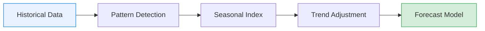

# Sales Analytics

## Overview

The Sales Analytics module provides comprehensive tools for analyzing revenue performance, product trends, and sales patterns. Use these insights to identify growth opportunities, optimize pricing, and forecast future performance.

---

## Revenue Trend Analysis

### Understanding Revenue Trends

Revenue trend analysis helps identify patterns in your sales data over time. The system tracks multiple revenue metrics:

| Metric | Calculation | Use Case |
|--------|-------------|----------|
| Gross Revenue | Sum of all order totals | Overall sales volume |
| Net Revenue | Gross - Returns - Discounts | Actual revenue received |
| Average Order Value | Total Revenue / Order Count | Customer spending behavior |
| Revenue per Customer | Total Revenue / Customer Count | Customer value assessment |

### Revenue Trend Visualization

The revenue trend chart displays monthly performance:

```
Revenue Trend (Last 12 Months)
------------------------------

$140k |                                    *
$120k |                               *
$100k |                          *
$80k  |                 *   *
$60k  |       *    *
$40k  | *  *
$20k  |
$0    +----------------------------------
       J  F  M  A  M  J  J  A  S  O  N  D
```

**Sample Data (Monthly Revenue):**

| Month | Revenue | Orders | Avg Order Value | Growth |
|-------|---------|--------|-----------------|--------|
| January | $45,000 | 150 | $300 | - |
| February | $52,000 | 175 | $297 | +15.6% |
| March | $48,000 | 160 | $300 | -7.7% |
| April | $67,000 | 220 | $305 | +39.6% |
| May | $75,000 | 250 | $300 | +11.9% |
| June | $82,000 | 275 | $298 | +9.3% |
| July | $78,000 | 260 | $300 | -4.9% |
| August | $91,000 | 305 | $298 | +16.7% |
| September | $98,000 | 328 | $299 | +7.7% |
| October | $105,000 | 352 | $298 | +7.1% |
| November | $112,000 | 375 | $299 | +6.7% |
| December | $125,000 | 418 | $299 | +11.6% |

**Annual Total:** $978,000

### Trend Analysis Features

**Moving Averages:**
- 7-day moving average (short-term trends)
- 30-day moving average (monthly patterns)
- 90-day moving average (quarterly trends)

**Growth Calculations:**
- Month-over-month (MoM)
- Quarter-over-quarter (QoQ)
- Year-over-year (YoY)

---

## Product Performance Metrics

### Top Products Analysis

Identify your best-performing products by various metrics:

**Top 5 Products by Revenue:**

| Rank | Product | Revenue | Units | Avg Price |
|------|---------|---------|-------|-----------|
| 1 | Product A | $125,000 | 420 | $297.62 |
| 2 | Product B | $98,000 | 355 | $276.06 |
| 3 | Product C | $87,000 | 310 | $280.65 |
| 4 | Product D | $65,000 | 245 | $265.31 |
| 5 | Product E | $52,000 | 195 | $266.67 |

### Product Performance Metrics

| Metric | Description | Formula |
|--------|-------------|---------|
| Revenue Contribution | % of total revenue | Product Revenue / Total Revenue |
| Sales Velocity | Units sold per day | Total Units / Days in Period |
| Profit Margin | Revenue minus cost | (Price - Cost) / Price |
| Stock Turnover | Inventory efficiency | Units Sold / Average Stock |

### Category Performance

**Revenue by Category:**

| Category | Revenue | % of Total | Growth |
|----------|---------|------------|--------|
| Electronics | $285,000 | 29.1% | +18.5% |
| Clothing | $195,000 | 19.9% | +12.3% |
| Home & Garden | $165,000 | 16.9% | +8.7% |
| Sports | $125,000 | 12.8% | +22.1% |
| Books | $85,000 | 8.7% | -3.2% |
| Other | $123,000 | 12.6% | +5.4% |

---

## Seasonal Patterns

### Identifying Seasonality

The system automatically detects seasonal patterns in your data:



### Seasonal Index

The seasonal index indicates relative performance by month:

| Month | Seasonal Index | Interpretation |
|-------|----------------|----------------|
| January | 0.85 | 15% below average |
| February | 0.92 | 8% below average |
| March | 0.88 | 12% below average |
| April | 1.05 | 5% above average |
| May | 1.12 | 12% above average |
| June | 1.18 | 18% above average |
| July | 1.08 | 8% above average |
| August | 1.15 | 15% above average |
| September | 1.10 | 10% above average |
| October | 1.08 | 8% above average |
| November | 1.20 | 20% above average |
| December | 1.35 | 35% above average |

> **Insight:** December shows the highest seasonal index (1.35), indicating peak sales season. January shows the lowest (0.85), suggesting post-holiday slowdown.

### Using Seasonal Data

**Planning Applications:**
- Inventory stocking decisions
- Marketing campaign timing
- Staffing requirements
- Cash flow projections

---

## Forecasting Features

### Forecast Methods

The system supports multiple forecasting algorithms:

| Method | Best For | Accuracy |
|--------|----------|----------|
| Linear Trend | Steady growth patterns | Moderate |
| Exponential Smoothing | Recent data emphasis | Good |
| Seasonal Decomposition | Seasonal businesses | Very Good |
| ARIMA | Complex patterns | Excellent |

### Revenue Forecast

**Next Quarter Forecast:**

| Month | Predicted Revenue | Confidence Range |
|-------|-------------------|------------------|
| Q2 - Month 1 | $135,000 | $128,000 - $142,000 |
| Q2 - Month 2 | $142,000 | $133,000 - $151,000 |
| Q2 - Month 3 | $138,000 | $127,000 - $149,000 |
| **Q2 Total** | **$415,000** | **$388,000 - $442,000** |

### Forecast Accuracy

Monitor forecast accuracy over time:

| Period | Forecasted | Actual | Variance | Accuracy |
|--------|------------|--------|----------|----------|
| October | $102,000 | $105,000 | +$3,000 | 97.1% |
| November | $115,000 | $112,000 | -$3,000 | 97.3% |
| December | $128,000 | $125,000 | -$3,000 | 97.6% |

**Average Forecast Accuracy:** 97.3%

---

## Regional Analysis

### Performance by Region

**Revenue Distribution:**

| Region | Revenue | Orders | Customers | AOV |
|--------|---------|--------|-----------|-----|
| Region A | $320,000 | 1,100 | 485 | $291 |
| Region B | $275,000 | 920 | 398 | $299 |
| Region C | $198,000 | 680 | 312 | $291 |
| Region D | $162,000 | 540 | 245 | $300 |
| **Total** | **$955,000** | **3,240** | **1,440** | **$295** |

### Regional Comparison

```
Regional Revenue Comparison
---------------------------

Region A  ████████████████████████████████  $320k (33.5%)
Region B  ███████████████████████████       $275k (28.8%)
Region C  ████████████████████             $198k (20.7%)
Region D  ████████████████                 $162k (17.0%)
```

---

## Sales Analytics Reports

### Available Report Types

| Report | Description | Schedule |
|--------|-------------|----------|
| Daily Sales Summary | Orders, revenue, top products | Daily |
| Weekly Performance | Week-over-week comparison | Weekly |
| Monthly Analysis | Comprehensive monthly review | Monthly |
| Product Performance | Detailed product metrics | Weekly |
| Regional Breakdown | Performance by region | Monthly |

### Generating Reports

1. Navigate to **Analytics** > **Sales Reports**
2. Select report type from dropdown
3. Choose date range
4. Apply filters (optional)
5. Click **Generate Report**
6. Export as PDF, Excel, or CSV

---

## Key Performance Indicators

### Sales KPIs Dashboard

Monitor these essential metrics:

| KPI | Current | Target | Status |
|-----|---------|--------|--------|
| Monthly Revenue | $125,000 | $120,000 | Above Target |
| Order Count | 418 | 400 | Above Target |
| Average Order Value | $299 | $300 | Near Target |
| Customer Acquisition | 52 | 50 | Above Target |
| Repeat Purchase Rate | 34% | 35% | Near Target |

### KPI Definitions

**Monthly Revenue Target:**
- Based on historical growth rate
- Adjusted for seasonality
- Reviewed quarterly

**Order Count Target:**
- Derived from revenue target
- Accounts for AOV trends
- Regional distribution

---

## Advanced Analytics

### Cohort Analysis

Track customer behavior over time:

| Cohort | Month 1 | Month 2 | Month 3 | Month 6 | Month 12 |
|--------|---------|---------|---------|---------|----------|
| Jan 2025 | 100% | 42% | 35% | 28% | 22% |
| Apr 2025 | 100% | 45% | 38% | 31% | - |
| Jul 2025 | 100% | 48% | 40% | - | - |
| Oct 2025 | 100% | 44% | - | - | - |

### RFM Scoring

Customers scored by Recency, Frequency, Monetary value:

| Segment | R Score | F Score | M Score | Action |
|---------|---------|---------|---------|--------|
| Champions | 5 | 5 | 5 | Reward loyalty |
| Loyal | 4-5 | 4-5 | 4-5 | Upsell premium |
| Potential | 4-5 | 2-3 | 2-3 | Increase engagement |
| At Risk | 2-3 | 3-4 | 3-4 | Re-engage |
| Lost | 1-2 | 1-2 | 1-2 | Win-back campaign |

---

## Exporting Data

### Export Options

| Format | Best For | Size Limit |
|--------|----------|------------|
| PDF | Presentations, printing | 50 pages |
| Excel | Further analysis | 100,000 rows |
| CSV | Data integration | 500,000 rows |

### Scheduled Exports

Configure automatic exports:

1. Go to **Settings** > **Scheduled Exports**
2. Click **New Schedule**
3. Select report type
4. Choose frequency (daily, weekly, monthly)
5. Set delivery method (email, SFTP)
6. Save schedule

---

## Related Documentation

- [Dashboard Overview](./dashboard-overview.md) - Main dashboard features
- [Customer Segmentation](./customer-segmentation.md) - Customer analysis
- [Report Generation](./report-generation.md) - Custom reports

---

**Document Version:** 1.0
**Last Updated:** January 2026
**Status:** Active
